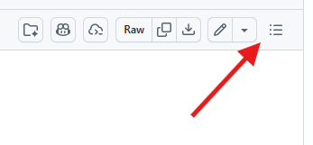

# Details: Learnings, Technologies, Projects

If you came directly here, most things are in [the README](./README.md). Please, take a look there first `:D`.

<!-- Most of my stuff is private for now, so nothing really interesting to see here.

TODO(marcelo): Reconsider adding this back once I publish more code.

## GitHub stats

  
  

-->

## Table of contents

Click on the outline button:

## The most important things that I learned so far

- **Tools are overrated; foundations are not.** With solid fundamentals, you can master almost any technology.

- **BUT... deep expertise is highly underrated.** Being the go-to person for a specific domain is a massive career advantage.

- **Developer Experience (DX) matters.** Bad technologies drain productivity. Good DX keeps teams fast and happy.

- **Design before you code.** Choosing the right architecture upfront saves countless hours of painful maintenance later.

- **Start with the problem, not the hammer.** Choose technologies based on requirements. The shiny new tool isn't always the right fit (unless you're just learning it).

- **Bad communication causes most problems.**
  1. Sending a message doesn't mean it was read. Double-check.
  2. Broadcasting to a group doesn't mean stakeholders saw it. Ping them directly.
  3. Over-communicating is almost always better than under-communicating.

- **Good documentation is a superpower.** It saves hours of meetings, prevents knowledge silos, and applies the DRY (Don't Repeat Yourself) principle to human communication.

- **Automated testing is non-negotiable** for any serious project.

- **Great UX is essential** if you want people to actually use what you build. And **performance is UX**, which is different than premature optimization.

## Will we be replaced by AI?

I don't think so!

I use AI heavily to boost productivity, but solid engineering foundations are still mandatory. How can I evaluate if an AI-generated algorithm is optimal if I don't understand its bounds?

To use these tools effectively, these fundamentals are more important than ever:

- Algorithms and data structures
- Software design and architecture
- Programming logic
- Testing & Documentation
- Code review
- Clear communication
- Great UI and UX

## Technologies and languages I use or used

### Currently using

- JavaScript and TypeScript
- Astro
- Tailwind CSS
- DaisyUI
- Clojure and ClojureScript

### The ones that I used the most are

- JavaScript (React, Node.js)
- Python
- C++
- Protocol Buffers
- HTML/CSS
- TypeScript
- Vim
- VSCode
- Bazel (build system)
- [Bash](https://www.youtube.com/watch?v=umDr0mPuyQc)
- Java
- REST (for APIs and databases - think CRUD)
- SQL/NoSQL

There's more, probably...

### Other ones I used way less and will separate into three groups

#### Used in at least one project

- Svelte
- Deno
- Next.js
- Go
- Tachyons CSS
- Bulma CSS
- Bootstrap CSS
- Material UI
- DaisyUI
- jQuery
- Objective-C

#### Played a little bit with

- Dart and Flutter
- F#
- Ruby (and Rails)
- Elm
- Rust
- V (vlang.io)

#### Read about

- Haskell
- Unison
- OCaml
- Erlang
- Elixir
- Gleam
- Lua

## Projects

Currently, take a look at the pinned ones at the [main page](https://github.com/marcelocra).
