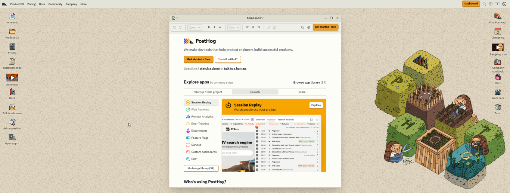
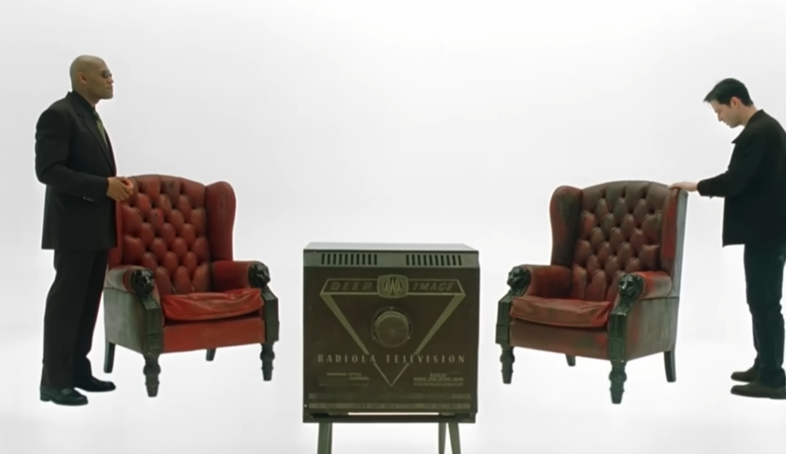

# Website Update

## Prompt first draft - v1

[Definitions]

- We will use RFCs 2119 and 8174 to ensure clarity and precision in our language.
- "I" refers to the author of this prompt.
- "You" refers to the reader (AI) of this prompt.

[Persona]
You are a world-class designer, brand specialist and logo creator. You learned from the best experts in the world, having read and internalized their most relevant work, guidelines and references. Use all your skills to create a logo and visual identity for this project, considering that it will be my personal website (at https://marcelo.land) and that it will contain all relevant references about me, including my professional experience, education, and personal projects. Be creative and follow the guidelines below, using the referenced pages and websites, as well as on my current website ( https://marcelocra.dev ).

[Context]
I have a professional looking website at https://marcelocra.dev , but it is not exactly as I want it to be. In particular, it is not that fun. The following sections describe my vision for the new website.

The new website MUST be mobile-first, responsive, and accessible.

It MUST look very modern, clean, and minimalist.

It MUST be interesting, with fun and creative features, and ideally with some Easter eggs.

Here are some interesting examples, though I don't want to copy them:

- Posthog: Their [homepage](https://posthog.com/) () is like a computer desktop, with each page being shown as a desktop shortcut icon. When opened, it launches as a desktop application.
- Niki (Tonsky): His [blog](https://tonsky.me/) features a playful portrait where his eyes are closed by default and open on hover. The dark mode is particularly creative—the page becomes pitch black with a spotlight effect that follows the cursor, simulating a flashlight illuminating the content.
- Lando Norris: His [homepage](https://landonorris.com/) has a bunch of fun and unique features, including a rotating 3D model of his helmet, special helmet versions, some easter eggs (type "disco" and a custom helmet appears), and other stuff about him.

And here are some detailed information about me, for you to put in the website:

- [About me](../about-me.md) and [README](../README.md): summarized version of my story, for quick consumption
- [My history](../my-history.md): my full history, with details about my education, work experience, and personal projects
- [Details](../details.md): some of my learnings, beliefs, and interests
- [References](../references.md): some references that I find interesting

Currently, the website has only one page, home, with the following sections:

- Hero: my name, links, CV and skills
- About: my history, including university education and work experience
- Projects: my personal projects and contributions to open-source
- Services: the services I used to offer, but you MUST remove this section
- Contact: a form for sending me a message
- Recent blog articles, with link to my blog (the blog is a separate page)

While I don't have a fully detailed structure for the new website yet, I have several ideas inspired by my interests that I'd like to share. Please use these as a foundation and reference when creating the plan.

My interests:

- I really like movies and series, so we could use interesting software/computing/internet references.
- I like superheros, though I think it might be too much childlike for a personal/professional site. We can use/make references, but not too many.
- I enjoy exploring new technologies and tools, so we can showcase some of the latest trends and innovations in the industry.
- I love programming and computing, so we can add some fun, interesting stuff, perhaps interactive, to the website.

Some ideas:

1. When people first get to the website, it could have a 1980s theme, with maybe some pixel art for a Delorean being turned on and immediately jumping through a portal to the future, arriving at a futuristic website. The portal could also be made as a reference to Marvel's multiverse.

2. Instead, it should start with a single television set at the middle of the screen, with no scroll, just some buttons in the set and my name, job title and a photo. The tv would have some named buttons that the user could interact with, like 'cv', 'projects', 'contact', etc.

3. Same tv set from idea 2, but in a more Matrix-like scene for when Morpheus first present stuff to Neo, with those red sofas.

4. The skill sections could feature Neo learning stuff from programs being installed in his mind, in a reference for how I use AI these days.

5. On scroll, the logo/home button could become Thanos Infinite Gauntlet from the Marvel Cinematic Universe, and if the user clicks on it, it could disintegrate the website into dust, show a brief message "sometimes there's only one chance...", show Iron Man version of the gauntlet below, which snaps and makes the website reapear in the home page.

And I just thought about them. Please, bring more ideas.

[Task]

1. You MUST create a plan for updating my website. It should be thorough and detailed, outlining all the steps that I (or an AI) can follow to achieve my vision.
2. You MUST create the full visual identity for the website, along with a logo description for it.
3. You MAY create a first, low-fidelity prototype of the website, using pixel art, html, css, and javascript.

[Rules]

1. You MUST search and find up-to-date information, as of November 26, 2025 (today).
2. You MUST NOT hallucinate or create/use false information.
3. It is okay to make assumptions that make sense in the context, but you MUST list them.
4. If you are unsure about something, you MUST either search for it online or ask for clarification.
5. You MUST provide your answer in the section below.

## Plan

---

### Executive Summary

This plan outlines the complete redesign of **marcelo.land**, transforming it from a professional but static portfolio into an immersive, interactive experience that reflects Marcelo's personality, technical expertise, and love for movies, technology, and computing culture. The website will feature a unique "Retro TV Portal" concept that bridges the past and future of computing, complete with Easter eggs, micro-interactions, and memorable moments.

**Core Concept: "The Time-Traveling Developer"**

The website will open with a retro CRT television set (1980s aesthetic) that serves as a portal to different "channels" representing sections of the site. Users can "change channels" to navigate, and the TV transforms as they explore—from retro to futuristic, symbolizing Marcelo's journey through technology.

---

### Part 1: Visual Identity & Branding

#### 1.1 Brand Concept

**Theme:** "Analog Roots, Digital Future"

The brand bridges nostalgia (CRT monitors, pixel art, VHS aesthetics) with cutting-edge technology (clean interfaces, smooth animations, modern typography). This duality represents Marcelo's journey from writing his first C code in 2010 to working at Google and building modern web applications.

**Brand Personality:**

- **Approachable** yet **professional**
- **Playful** yet **competent**
- **Nostalgic** yet **forward-thinking**
- **Technical** yet **human**

#### 1.2 Logo Design

**Primary Logo: "The Portal M"**

The logo is a stylized letter "M" that doubles as a visual metaphor:

1. **Shape:** The "M" is constructed from two vertical lines connected by a chevron/arrow pointing upward, resembling:

   - A code bracket `{ }` rotated and merged
   - A portal or gateway
   - The peaks of a signal wave (referencing TV signals)

2. **Animation States:**

   - **Static:** Clean, geometric "M" with subtle scan-line texture
   - **Hover:** The "M" glitches briefly with RGB chromatic aberration
   - **Loading:** The "M" fills up like a progress bar
   - **Easter Egg:** When clicked 5 times, transforms into a pixelated DeLorean

3. **Color Treatment:**

   - Primary: Electric cyan (#00FFE0) on dark backgrounds
   - Secondary: Deep purple (#6B21A8) for accents
   - The logo can shift between these colors to indicate light/dark mode

4. **Variations:**
   - **Favicon:** Simplified "M" portal shape
   - **Full Logo:** "M" + "marcelo.land" in custom typography
   - **Animated:** For hero sections and loading screens

#### 1.3 Color Palette

**Primary Colors:**

| Name          | Hex     | Usage                        |
| ------------- | ------- | ---------------------------- |
| Void Black    | #0A0A0F | Primary background           |
| CRT Glow      | #00FFE0 | Primary accent, links, CTAs  |
| Portal Purple | #6B21A8 | Secondary accent, gradients  |
| Signal White  | #F0F0F5 | Primary text on dark         |
| Static Gray   | #2A2A35 | Secondary backgrounds, cards |

**Secondary Colors:**

| Name         | Hex     | Usage                                    |
| ------------ | ------- | ---------------------------------------- |
| Retro Amber  | #FFB800 | Warnings, highlights, nostalgia elements |
| Matrix Green | #00FF41 | Code snippets, terminal effects          |
| Error Red    | #FF3366 | Errors, important notices                |
| VHS Blue     | #0066FF | Links, interactive elements              |

**Gradients:**

- **Portal Gradient:** `linear-gradient(135deg, #6B21A8 0%, #00FFE0 100%)`
- **CRT Fade:** `linear-gradient(180deg, #0A0A0F 0%, #1A1A2F 100%)`
- **Scan Line Overlay:** Subtle horizontal lines at 2px intervals, 5% opacity

#### 1.4 Typography

**Primary Font: "Space Grotesk"**

- Use for headings, navigation, and UI elements
- Weights: 400, 500, 700
- Modern geometric sans-serif with subtle quirks

**Secondary Font: "JetBrains Mono"**

- Use for code snippets, technical content, and the "terminal" aesthetic
- Weights: 400, 700
- Excellent readability for code

**Accent Font: "Press Start 2P" (sparingly)**

- Use ONLY for Easter eggs, retro elements, and special animations
- Creates the pixel/8-bit aesthetic for nostalgic moments

**Type Scale:**

```
Hero Title:     4rem / 64px (clamp: 2.5rem, 5vw, 4rem)
Section Title:  2.5rem / 40px
Card Title:     1.5rem / 24px
Body:           1rem / 16px
Small:          0.875rem / 14px
Micro:          0.75rem / 12px
```

#### 1.5 Iconography & Imagery

**Icon Style:**

- Line icons with 2px stroke
- Rounded corners (2px radius)
- Can have subtle glow effect on hover
- Custom icons for navigation that resemble TV remote buttons

**Imagery Guidelines:**

- Profile photos should have a subtle CRT scan-line overlay option
- Project screenshots displayed as if on old monitors initially, morphing to modern frames
- Use pixel art sparingly for decorative elements and Easter eggs
- All images optimized for web (WebP format, lazy loading)

---

### Part 2: Technical Architecture

#### 2.1 Technology Stack

**Framework:** ~~Astro 4.x (keep current stack, it's excellent for this use case)~~ Next.js 16.x

- Hybrid (static/server rendered) generation for performance
- Built-in image optimization

**Styling:**

- ~~Tailwind CSS 3.x~~ Tailwind CSS 4.x and Shadcn UI for utility-first styling
- Custom CSS for animations and special effects
- CSS custom properties for theming

**Interactivity:**

- ~~Vanilla JavaScript~~ React for simple interactions
- GSAP (GreenSock) for complex animations
- Three.js for 3D elements (TV model, portal effects) - optional, can use CSS 3D transforms
- Howler.js for sound effects (optional, user-controlled)

**Hosting:** Deno Deploy (current) or Vercel/Netlify

#### 2.2 Performance Requirements

- **Lighthouse Score:** 90+ on all metrics
- **First Contentful Paint:** < 1.5s
- **Time to Interactive:** < 3s
- **Core Web Vitals:** All green
- Progressive enhancement: Site MUST work without JavaScript (basic version)

#### 2.3 Accessibility Requirements

- WCAG 2.1 AA compliance minimum
- Keyboard navigation for all interactive elements
- Screen reader compatible
- Reduced motion option (respects `prefers-reduced-motion`)
- Skip links for main content
- Sufficient color contrast (4.5:1 minimum)
- Focus indicators on all interactive elements

---

### Part 3: Site Structure & Navigation

#### 3.1 Information Architecture

```
marcelo.land/
├── / (Home - The TV Portal)
├── /about (About Me - Channel 1)
├── /experience (Work & Education Timeline - Channel 2)
├── /projects (Project Showcase - Channel 3)
├── /blog (Blog/Articles - Channel 4)
├── /contact (Contact Form - Channel 5)
├── /uses (Tech Stack & Tools - Hidden Channel)
└── /play (Easter Eggs Collection - Secret Channel)
```

#### 3.2 Navigation Concept: "The Remote Control"

**Desktop:**

- Fixed navigation bar transforms based on scroll position
- At top: Full TV remote-style navigation with channel numbers
- On scroll: Compact floating remote icon that expands on hover
- Easter egg: Konami code reveals secret menu

**Mobile:**

- Bottom navigation bar styled as a simplified remote
- Swipe gestures to "change channels" between main sections
- Hamburger menu opens as a "TV Guide" overlay

**Navigation Items:**

1. **CH 1** - About (👤)
2. **CH 2** - Experience (📺)
3. **CH 3** - Projects (🎮)
4. **CH 4** - Blog (📝)
5. **CH 5** - Contact (📞)

- **PWR** - Theme toggle (light/dark)
- **MUTE** - Sound toggle (if sounds are implemented)

---

### Part 4: Page-by-Page Design Details

#### 4.1 Home Page: "The TV Portal"

**Hero Section (100vh, no scroll initially)**

The page loads with a CRT television set centered on screen. The experience unfolds as follows:

1. **Initial Load (0-2s):**

   - Screen is black with subtle static noise
   - A power-on sound plays (optional, user can skip)
   - The TV "warms up" with a growing white dot that expands to fill the screen

2. **Introduction (2-4s):**

   - The TV screen displays:
     ```
     CHANNEL: marcelo.land
     ─────────────────────
     MARCELO ALMEIDA
     Full-Stack Developer
     Ex-Google • ITA • 16+ Years
     ─────────────────────
     [Press any key or click to continue]
     ```
   - A blinking cursor invites interaction
   - Profile photo appears in a small "picture-in-picture" corner

3. **Channel Selection (after interaction):**
   - The TV remote interface appears
   - Users can click channel buttons to navigate
   - Or they can scroll down to reveal the full site

**TV Design Details:**

- 3D CSS transform to give depth
- Curved screen effect using border-radius and gradients
- Scan lines overlay (toggle-able for accessibility)
- VHS tracking effect on channel change
- Wood-grain cabinet texture for retro feel

**Below the Fold:**

- Smooth scroll reveals the "modern" website
- The TV shrinks and docks in the header as the logo
- Content sections fade in with scroll-triggered animations

**Quick Links Section:**

- Bento grid layout with 6 cards:
  - GitHub (external)
  - LinkedIn (external)
  - Download CV (PDF)
  - Latest Blog Post
  - Featured Project
  - Contact Me

#### 4.2 About Page: "Channel 1 - Who Am I?"

**Concept:** A documentary-style presentation about Marcelo

**Sections:**

1. **Opening Title Card:**

   - "CHANNEL 1: ABOUT" with VHS timestamp
   - Brief tagline: "The story of a code enthusiast"

2. **Bio Section:**

   - Two-column layout (photo + text on desktop)
   - Photo with subtle parallax effect
   - Key facts highlighted:
     - 🎓 Computer Engineer from ITA
     - 🔵 Ex-Google (4.5 years)
     - 💻 16+ years coding
     - 🚀 Entrepreneur

3. **Philosophy Section:**

   - Animated quotes from the details.md learnings
   - Cards that flip to reveal more detail
   - Topics: Good practices, DX, Communication, Documentation

4. **Fun Facts:**
   - Interactive "Did you know?" cards
   - Include personality elements (movies, tech interests)

#### 4.3 Experience Page: "Channel 2 - The Journey"

**Concept:** An interactive timeline styled as a TV programming guide

**Design:**

1. **Timeline Navigation:**

   - Horizontal scrolling timeline (desktop)
   - Vertical scroll (mobile)
   - Years as markers: 2010 → Present

2. **Experience Cards:**
   Each experience is a "TV show" card with:

   - "Show" thumbnail (company logo or relevant image)
   - Title (position)
   - Network (company name)
   - Season (years)
   - Episode count (key achievements as bullet points)
   - Genre tags (technologies used)

3. **Major Milestones:**

   - **2010:** "Pilot Episode" - First line of C code at ITA
   - **2013:** "International Special" - Exchange in Netherlands
   - **2015:** "The Internship" - Google Intern
   - **2016-2020:** "The Google Years" - Full-time SWE
   - **2020:** "Spin-off" - Left Google, started entrepreneurship
   - **2022:** "Guest Appearance" - Hubla
   - **2025:** "Current Season" - Building micro-SaaS

4. **Matrix Easter Egg:**
   - Hidden button labeled "Take the red pill"
   - Triggers Neo's training sequence animation
   - Skills rain down Matrix-style
   - Message: "I know Kung Fu... and JavaScript, Python, C++..."

#### 4.4 Projects Page: "Channel 3 - The Portfolio"

**Concept:** Projects displayed as a game selection menu (like Netflix or PlayStation)

**Design:**

1. **Featured Project Banner:**

   - Large hero card with animated preview
   - Auto-rotating through 3 featured projects
   - Play button reveals project demo/video

2. **Project Grid:**

   - Bento-style grid layout
   - Cards with:
     - Screenshot/preview
     - Project name
     - Brief description
     - Tech stack pills
     - Links (live site, GitHub)
   - Hover effect: Card "pops out" with glow

3. **Categories/Filters:**

   - All Projects
   - Active (recent tag)
   - Open Source
   - Chrome Extensions
   - Learning/Experiments
   - Archived

4. **Projects to Feature:**
   - YourLinx
   - Personal Website (meta!)
   - Dev Workflow Utils
   - Chrome Extensions collection
   - Learning stuff repo

#### 4.5 Blog Page: "Channel 4 - The Broadcasts"

**Concept:** Blog styled as a TV broadcast archive

**Design:**

1. **Featured Post:**

   - Large card at top
   - "Breaking News" style banner for newest post

2. **Post Grid:**

   - Two-column masonry layout
   - Cards show:
     - Title
     - Excerpt
     - Date (VHS timestamp style)
     - Tags
     - Read time

3. **Categories:**

   - All Posts
   - Technical
   - Learning in Public
   - Career
   - Portuguese 🇧🇷

4. **RSS Feed:**
   - Prominent RSS button styled as antenna icon

#### 4.6 Contact Page: "Channel 5 - Get in Touch"

**Concept:** A "call-in show" interface

**Design:**

1. **Contact Options:**

   - Email: hello2@marcelocra.com (primary)
   - LinkedIn
   - GitHub
   - Form for direct messages

2. **Contact Form:**

   - Styled as a TV broadcast submission form
   - Fields:
     - Name ("Caller name")
     - Email ("Return frequency")
     - Subject ("Topic")
     - Message ("Your message")
   - Submit button: "📡 Broadcast Message"

3. **Response Time Indicator:**
   - "Currently accepting transmissions"
   - Average response time badge

#### 4.7 Uses Page: "Hidden Channel - The Setup"

**Concept:** A /uses page showing Marcelo's tech stack and tools

**Sections:**

- Hardware (computer, monitors, etc.)
- Development Tools (VS Code, terminals)
- Languages & Frameworks
- Design Tools
- Productivity Apps

**Easter Egg:** Accessible by typing "uses" anywhere on the site

#### 4.8 Play Page: "Secret Channel - Easter Eggs"

**Concept:** A collection of all discovered Easter eggs

- Only accessible after finding at least one Easter egg
- Shows a checklist of all hidden features
- Unlocks achievements (just for fun)

---

### Part 5: Interactive Features & Easter Eggs

#### 5.1 Micro-Interactions

| Element     | Interaction | Animation                                        |
| ----------- | ----------- | ------------------------------------------------ |
| Buttons     | Hover       | Subtle glow + lift (transform: translateY(-2px)) |
| Links       | Hover       | Underline draws from left to right               |
| Cards       | Hover       | Scale up 2% + shadow increase                    |
| Navigation  | Scroll      | Compact/expand transition                        |
| Images      | Load        | Fade in with slight blur-to-sharp                |
| Form inputs | Focus       | Border glow animation                            |

#### 5.2 Scroll Animations

- **Fade-in:** Elements fade and slide up on scroll (staggered)
- **Parallax:** Background elements move at different speeds
- **Progress:** Reading progress bar on blog posts
- **Sticky headers:** Section titles stick briefly while scrolling

#### 5.3 Easter Eggs Collection

1. **Konami Code (↑↑↓↓←→←→BA):**

   - Triggers "retro mode" - entire site becomes 8-bit styled
   - Plays chiptune version of a famous theme
   - Lasts for 30 seconds or until ESC pressed

2. **"Disco" keyword (type anywhere):**

   - Inspired by Lando Norris site
   - Rainbow gradient animation on all text
   - Disco ball appears and spins
   - Optional: plays brief disco clip

3. **The Snap (Thanos Easter Egg):**

   - After scrolling past hero, logo becomes a gauntlet icon
   - Click 5 times to "collect infinity stones" (progress indicator)
   - Final click triggers:
     - Screen flash
     - Elements disintegrate into particles
     - Message: "I am inevitable... but so are bugs."
     - Iron Man gauntlet appears
     - "Snap" restores everything with message: "And I... am... a developer."
     - Redirects to home

4. **Matrix Mode (type "matrix"):**

   - Green text rain animation overlay
   - All text temporarily turns green
   - Console logs: "Wake up, Marcelo..."

5. **Time Travel (type "1985" or "88mph"):**

   - DeLorean pixel art zooms across screen
   - Brief flash of lightning
   - Site temporarily shows "retro" version

6. **Developer Console Message:**

   - Custom ASCII art logo
   - Message: "Hey there, fellow developer! 👋 Like what you see? Let's connect!"
   - Links to GitHub and contact

7. **404 Page Easter Egg:**

   - TV displaying static/snow
   - "Channel not found - Please stand by"
   - Random channel surfing animation
   - Button: "Return to regular programming"

8. **Coffee Counter (click coffee emoji):**
   - Hidden coffee emoji somewhere on the page
   - Clicking increments a counter
   - At 10: "That's a lot of coffee! ☕️"
   - Counter persists in localStorage

#### 5.4 Sound Design (Optional, User-Controlled)

- **Default:** Sounds OFF (respect user preference)
- **Toggle:** Mute button in navigation
- **Sounds:**
  - TV power on/off
  - Channel change (brief static)
  - Button clicks (subtle)
  - Easter egg triggers (unique sounds)

---

### Part 6: Implementation Phases

#### Phase 1: Foundation (Week 1-2)

**Tasks:**

- [ ] Set up new Astro project with Tailwind CSS
- [ ] Implement design tokens (colors, typography, spacing)
- [ ] Create base components:
  - [ ] Button variants
  - [ ] Card component
  - [ ] Navigation (mobile + desktop)
  - [ ] Footer
- [ ] Set up responsive breakpoints
- [ ] Implement light/dark theme toggle
- [ ] Create logo SVG and favicon

**Deliverables:**

- Functioning site skeleton
- Design system documentation
- Component library started

#### Phase 2: Core Pages (Week 3-4)

**Tasks:**

- [ ] Home page (without TV animation initially)
  - [ ] Hero section
  - [ ] Quick links bento grid
  - [ ] Intro section
- [ ] About page
  - [ ] Bio section
  - [ ] Philosophy cards
- [ ] Experience page
  - [ ] Timeline component
  - [ ] Experience cards
- [ ] Projects page
  - [ ] Project grid
  - [ ] Filtering system
- [ ] Contact page
  - [ ] Contact form (integrate with email service)
  - [ ] Contact info display
- [ ] Blog page (if keeping blog)
  - [ ] Post list
  - [ ] Post template

**Deliverables:**

- All main pages functional
- Basic styling complete
- Mobile responsive

#### Phase 3: The TV Experience (Week 5-6)

**Tasks:**

- [ ] Design and build TV component
  - [ ] 3D CSS transforms
  - [ ] Scan line overlay
  - [ ] Screen content area
- [ ] TV power-on animation
- [ ] Channel switching mechanism
- [ ] TV-to-header transformation on scroll
- [ ] Navigation remote control styling
- [ ] VHS/retro effects library

**Deliverables:**

- Complete TV portal experience
- Smooth transitions
- Performance optimized

#### Phase 4: Polish & Easter Eggs (Week 7-8)

**Tasks:**

- [ ] Implement scroll animations (GSAP or CSS)
- [ ] Add micro-interactions to all elements
- [ ] Implement Easter eggs:
  - [ ] Konami code
  - [ ] Disco mode
  - [ ] Matrix mode
  - [ ] Developer console message
- [ ] 404 page design
- [ ] Loading states and skeletons
- [ ] Accessibility audit and fixes
- [ ] Performance optimization
  - [ ] Image optimization
  - [ ] Code splitting
  - [ ] Critical CSS

**Deliverables:**

- All Easter eggs functional
- Polished animations
- A11y compliant
- Performance optimized

#### Phase 5: Testing & Launch (Week 9-10)

**Tasks:**

- [ ] Cross-browser testing (Chrome, Firefox, Safari, Edge)
- [ ] Device testing (various screen sizes)
- [ ] Accessibility testing with screen readers
- [ ] Performance testing (Lighthouse)
- [ ] Content review and finalization
- [ ] SEO optimization
  - [ ] Meta tags
  - [ ] Open Graph images
  - [ ] Structured data
- [ ] Analytics setup
- [ ] Domain configuration (marcelo.land)
- [ ] Launch! 🚀

**Deliverables:**

- Production-ready website
- Documentation for future updates
- Launch checklist completed

---

### Part 7: Additional Ideas & Recommendations

#### 7.1 Additional Feature Ideas

1. **AI Chat Assistant:**

   - A small chatbot styled as a "TV host"
   - Answers basic questions about Marcelo
   - Powered by a simple FAQ or AI API

2. **Visitors Map:**

   - Anonymous visitor location display
   - "Viewers from around the world"
   - Could show as a retro broadcast map

3. **Now Playing:**

   - Integration with Spotify or Last.fm
   - Shows what Marcelo is currently listening to
   - Styled as a TV ticker

4. **Code Playground:**

   - Embedded code editor for demos
   - Let visitors run simple code snippets
   - "Try it yourself" sections

5. **Achievement System:**
   - Track Easter eggs found
   - Award badges for exploration
   - Shareable achievement cards

#### 7.2 Content Recommendations

1. **Blog Topics to Add:**

   - "My journey from ITA to Google"
   - "Why I left Google to build my own thing"
   - "Lessons learned from 16+ years of coding"
   - "My favorite (and least favorite) technologies"

2. **Project Documentation:**

   - Add case studies for major projects
   - Include problem → solution → results format
   - Add technical deep-dives

3. **Regular Updates:**
   - Monthly "Now" page updates
   - Quarterly "Uses" page review
   - Keep blog active

#### 7.3 Marketing & Discoverability

1. **Social Media Integration:**

   - Open Graph images for each page
   - Twitter Card support
   - Shareable project cards

2. **SEO Focus:**

   - Target "full-stack developer portfolio"
   - Blog posts for long-tail keywords
   - Structured data for rich snippets

3. **Community Building:**
   - Newsletter signup
   - RSS feed prominent
   - Comment system on blog (optional)

---

### Part 8: Assumptions

The following assumptions have been made while creating this plan:

1. **Domain:** The domain `marcelo.land` is available and will be configured for this project. [Correct: I'm the owner and will configure it.]

2. **Hosting:** Current Deno Deploy setup will continue, or a similar JAMstack hosting will be used. [Incorrect: You should not use or consider the current site for anything I didn't say here. For marcelo.land I'll be using Next.js 16+, Tailwind CSS 4+ with Shadcn UI, in Vercel.]

3. **Content:** All content from the current site will be migrated, with the Services section removed as requested. [Partially correct: We can use the site's content as reference, but we can improve it too.]

4. **Timeline:** The 10-week implementation timeline assumes part-time work or AI assistance. Full-time focus could reduce this significantly. [Incorrect: Your low-fidelity prototype already does a LOT, so most likely we will take way less than 10 weeks.]

5. **Budget:** No significant budget constraints for stock assets or premium tools; will use free/open-source alternatives where possible. [Incorrect: For any complicated asset, you should provide detailed prompts so that I can generate them using AI tools. My goal is to keep the project at zero cost.]

6. **Browser Support:** Modern browsers only (Chrome, Firefox, Safari, Edge - last 2 versions). IE is not supported. [Correct]

7. **Sound Effects:** If implemented, sounds will be royalty-free or created specifically for the project. [Correct]

8. **3D Elements:** The TV and other 3D elements will use CSS transforms first; Three.js only if CSS proves insufficient. [Not sure: We can use whatever is simplest. We don't even need the TV to be 3D. If we go for the 3D view, I wanted something like that Matrix scene in which Morpheus and Neo see the TV, with those old red sofas ()].

9. **Blog Migration:** The existing blog content will be migrated to the new design. [Correct]

10. **Contact Form:** A backend service (Formspree, Netlify Forms, or similar) will handle form submissions. [Correct]

11. **Analytics:** Privacy-respecting analytics (Plausible, Fathom, or similar) will be used instead of Google Analytics. [Incorrect: I'll likely use Google Analytics and/or Posthog, but not sure yet.]

12. **Easter Eggs:** Easter eggs are fun additions and MUST NOT interfere with the core functionality or accessibility of the site. [Correct]

---

### Part 9: Low-Fidelity Prototype

Below is a basic HTML/CSS prototype demonstrating the TV Portal concept. This can be expanded into a full prototype:

```html
<!-- Save as: prototype/index.html -->
<!DOCTYPE html>
<html lang="en">
  <head>
    <meta charset="UTF-8" />
    <meta name="viewport" content="width=device-width, initial-scale=1.0" />
    <title>marcelo.land - TV Portal Prototype</title>
    <style>
      * {
        margin: 0;
        padding: 0;
        box-sizing: border-box;
      }

      :root {
        --void-black: #0a0a0f;
        --crt-glow: #00ffe0;
        --portal-purple: #6b21a8;
        --signal-white: #f0f0f5;
        --static-gray: #2a2a35;
        --retro-amber: #ffb800;
      }

      body {
        font-family: "Space Grotesk", system-ui, sans-serif;
        background: var(--void-black);
        color: var(--signal-white);
        min-height: 100vh;
        display: flex;
        align-items: center;
        justify-content: center;
        overflow: hidden;
      }

      .tv-container {
        perspective: 1000px;
      }

      .tv {
        width: 600px;
        height: 500px;
        background: linear-gradient(145deg, #3a3a3a 0%, #1a1a1a 100%);
        border-radius: 20px;
        padding: 40px;
        transform: rotateX(2deg);
        box-shadow: 0 30px 60px rgba(0, 0, 0, 0.5), inset 0 2px 0 rgba(255, 255, 255, 0.1);
        position: relative;
      }

      .tv::before {
        content: "";
        position: absolute;
        bottom: 0;
        left: 50%;
        transform: translateX(-50%);
        width: 200px;
        height: 60px;
        background: linear-gradient(to bottom, #2a2a2a, #1a1a1a);
        border-radius: 0 0 10px 10px;
      }

      .screen {
        width: 100%;
        height: 320px;
        background: #000;
        border-radius: 15px;
        overflow: hidden;
        position: relative;
        box-shadow: inset 0 0 50px rgba(0, 255, 224, 0.1), 0 0 20px rgba(0, 255, 224, 0.2);
      }

      .screen::after {
        content: "";
        position: absolute;
        top: 0;
        left: 0;
        right: 0;
        bottom: 0;
        background: repeating-linear-gradient(
          0deg,
          rgba(0, 0, 0, 0.1) 0px,
          rgba(0, 0, 0, 0.1) 1px,
          transparent 1px,
          transparent 2px
        );
        pointer-events: none;
      }

      .screen-content {
        padding: 30px;
        height: 100%;
        display: flex;
        flex-direction: column;
        justify-content: center;
        font-family: "JetBrains Mono", monospace;
      }

      .channel-indicator {
        position: absolute;
        top: 15px;
        right: 20px;
        font-size: 14px;
        color: var(--crt-glow);
        text-shadow: 0 0 10px var(--crt-glow);
      }

      .title {
        font-size: 24px;
        color: var(--crt-glow);
        text-shadow: 0 0 20px var(--crt-glow);
        margin-bottom: 10px;
      }

      .subtitle {
        font-size: 16px;
        color: var(--signal-white);
        opacity: 0.8;
      }

      .tagline {
        font-size: 14px;
        color: var(--retro-amber);
        margin-top: 20px;
      }

      .cta {
        margin-top: 30px;
        font-size: 12px;
        color: var(--signal-white);
        opacity: 0.6;
        animation: blink 1s infinite;
      }

      @keyframes blink {
        0%,
        50% {
          opacity: 0.6;
        }
        51%,
        100% {
          opacity: 0;
        }
      }

      .controls {
        display: flex;
        justify-content: space-between;
        align-items: center;
        margin-top: 20px;
      }

      .channel-buttons {
        display: flex;
        gap: 10px;
      }

      .channel-btn {
        width: 40px;
        height: 40px;
        border-radius: 50%;
        border: none;
        background: var(--static-gray);
        color: var(--signal-white);
        font-size: 12px;
        cursor: pointer;
        transition: all 0.2s;
      }

      .channel-btn:hover {
        background: var(--crt-glow);
        color: var(--void-black);
        box-shadow: 0 0 15px var(--crt-glow);
      }

      .power-btn {
        width: 50px;
        height: 50px;
        border-radius: 50%;
        border: none;
        background: #ff3366;
        color: white;
        font-size: 14px;
        cursor: pointer;
        box-shadow: 0 0 10px rgba(255, 51, 102, 0.5);
      }

      .brand {
        position: absolute;
        bottom: 75px;
        left: 50%;
        transform: translateX(-50%);
        font-size: 12px;
        color: #666;
        letter-spacing: 3px;
      }
    </style>
    <link rel="preconnect" href="https://fonts.googleapis.com" />
    <link rel="preconnect" href="https://fonts.gstatic.com" crossorigin />
    <link
      href="https://fonts.googleapis.com/css2?family=JetBrains+Mono:wght@400;700&family=Space+Grotesk:wght@400;500;700&display=swap"
      rel="stylesheet"
    />
  </head>
  <body>
    <div class="tv-container">
      <div class="tv">
        <div class="screen">
          <div class="screen-content">
            <div class="channel-indicator">CH: marcelo.land</div>
            <div class="title">MARCELO ALMEIDA</div>
            <div class="subtitle">Full-Stack Developer</div>
            <div class="tagline">Ex-Google • ITA • 16+ Years Experience</div>
            <div class="cta">[ Press any channel to explore ]</div>
          </div>
        </div>
        <div class="controls">
          <div class="channel-buttons">
            <button class="channel-btn" title="About">1</button>
            <button class="channel-btn" title="Experience">2</button>
            <button class="channel-btn" title="Projects">3</button>
            <button class="channel-btn" title="Blog">4</button>
            <button class="channel-btn" title="Contact">5</button>
          </div>
          <button class="power-btn">PWR</button>
        </div>
        <div class="brand">MARCELO.LAND</div>
      </div>
    </div>

    <script>
      // Simple channel switching demo
      const channels = {
        1: {
          title: "ABOUT",
          subtitle: "Who is Marcelo?",
          tagline: "Computer Engineer • Entrepreneur • Tech Enthusiast",
        },
        2: {
          title: "EXPERIENCE",
          subtitle: "The Journey",
          tagline: "ITA → Google → Startups → Entrepreneurship",
        },
        3: {
          title: "PROJECTS",
          subtitle: "What I Build",
          tagline: "Web Apps • Chrome Extensions • Open Source",
        },
        4: {
          title: "BLOG",
          subtitle: "Thoughts & Learnings",
          tagline: "Technical Writing • Tutorials • Insights",
        },
        5: {
          title: "CONTACT",
          subtitle: "Get in Touch",
          tagline: "hello2@marcelocra.com",
        },
      };

      document.querySelectorAll(".channel-btn").forEach((btn) => {
        btn.addEventListener("click", () => {
          const ch = btn.textContent;
          const data = channels[ch];
          if (data) {
            // Add static effect
            const screen = document.querySelector(".screen-content");
            screen.style.opacity = "0";
            setTimeout(() => {
              document.querySelector(".title").textContent = data.title;
              document.querySelector(".subtitle").textContent = data.subtitle;
              document.querySelector(".tagline").textContent = data.tagline;
              document.querySelector(
                ".channel-indicator"
              ).textContent = `CH ${ch}: ${data.title.toLowerCase()}`;
              screen.style.opacity = "1";
            }, 150);
          }
        });
      });

      // Konami code Easter egg
      const konamiCode = [
        "ArrowUp",
        "ArrowUp",
        "ArrowDown",
        "ArrowDown",
        "ArrowLeft",
        "ArrowRight",
        "ArrowLeft",
        "ArrowRight",
        "b",
        "a",
      ];
      let konamiIndex = 0;

      document.addEventListener("keydown", (e) => {
        if (e.key === konamiCode[konamiIndex]) {
          konamiIndex++;
          if (konamiIndex === konamiCode.length) {
            alert("🎮 KONAMI CODE ACTIVATED! Retro mode would trigger here.");
            konamiIndex = 0;
          }
        } else {
          konamiIndex = 0;
        }
      });

      console.log(
        "%c Welcome to marcelo.land! 👋",
        "font-size: 20px; color: #00FFE0;"
      );
      console.log(
        "%c Try the Konami code: ↑↑↓↓←→←→BA",
        "font-size: 12px; color: #FFB800;"
      );
    </script>
  </body>
</html>
```

---

### Summary

This comprehensive plan provides:

1. **Visual Identity:** A complete brand system with the "Portal M" logo, color palette (CRT Glow cyan, Portal Purple, Void Black), typography (Space Grotesk + JetBrains Mono), and design guidelines.

2. **Technical Architecture:** Recommended stack (Astro + Tailwind + GSAP), performance targets, and accessibility requirements.

3. **Site Structure:** Clear information architecture with the TV/channel navigation metaphor.

4. **Detailed Page Designs:** Specifications for every page including the TV Portal home, About, Experience timeline, Projects showcase, Blog, and Contact.

5. **Interactive Features:** Micro-interactions, scroll animations, and 8 carefully designed Easter eggs (Konami code, Disco mode, Thanos snap, Matrix mode, etc.).

6. **Implementation Roadmap:** A 10-week phased approach with clear deliverables.

7. **Low-Fidelity Prototype:** A working HTML/CSS/JS demo of the TV Portal concept.

The design successfully balances professionalism with personality, creating a memorable experience that showcases Marcelo's technical expertise while reflecting his interests in movies, technology, and creative computing.

## Prompt continued - v2

That's amazing! I'm loving the ideas. There's a couple of pending changes:

1. I have some projects that are open source and some that are proprietary and for profit, under the umbrella of a company that I'm creating. My initial idea was to keep those separated, perhaps with a page listing the open source projects and another one for the products. What do you think?

1. There's a really nice, fun, movie Easter egg called [Willhelm Scream](https://en.wikipedia.org/wiki/Wilhelm_scream). I don't know how yet, but I'm sure we can find a way to add it.

1. Seems like your low-fidelity prototype already has A LOT of what I wanted. Please, continue refining it so that we have a fully complete MVP, even if it's just a basic version. We can do it in rounds, for me to check each part.

## The Plan, continued - v2
